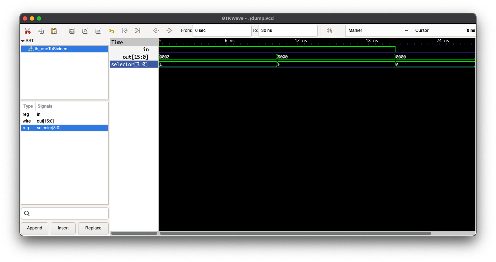

## EDA Playground

https://www.edaplayground.com/x/76EW

## Resources

The output relations were built upon mux truth tables obtained from:
https://www.geeksforgeeks.org/what-is-demultiplexerdemux/

## Output

