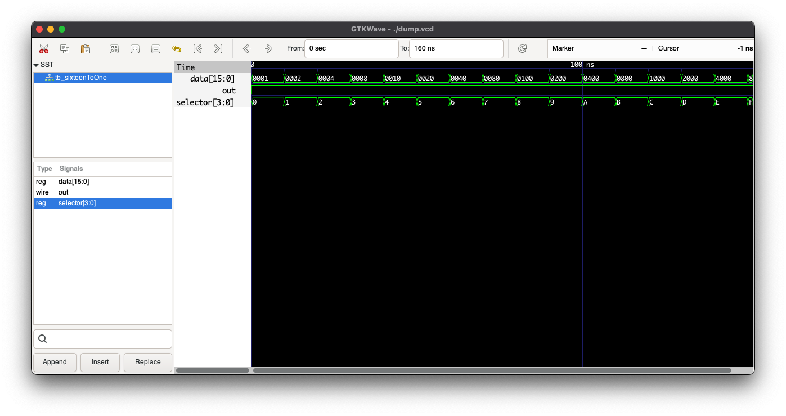

## EDA Playground

https://www.edaplayground.com/x/du8U

## Resources

The output relations were built upon mux truth tables obtained from:
https://www.geeksforgeeks.org/encoders-and-decoders-in-digital-logic/

## Output

