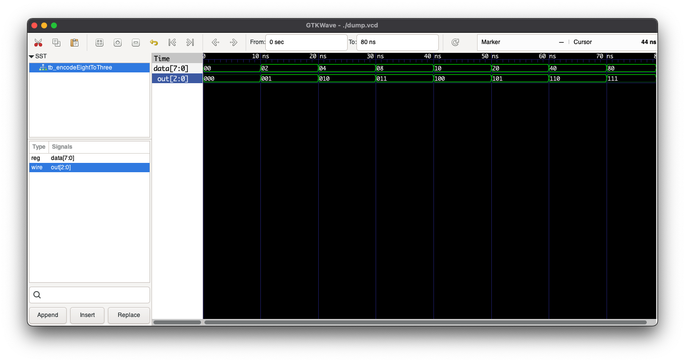

## EDA Playground

https://www.edaplayground.com/x/8rKm

## Resources

The output relations were obtained from karnough maps sourced from:
https://www.geeksforgeeks.org/encoders-and-decoders-in-digital-logic/

## Output

