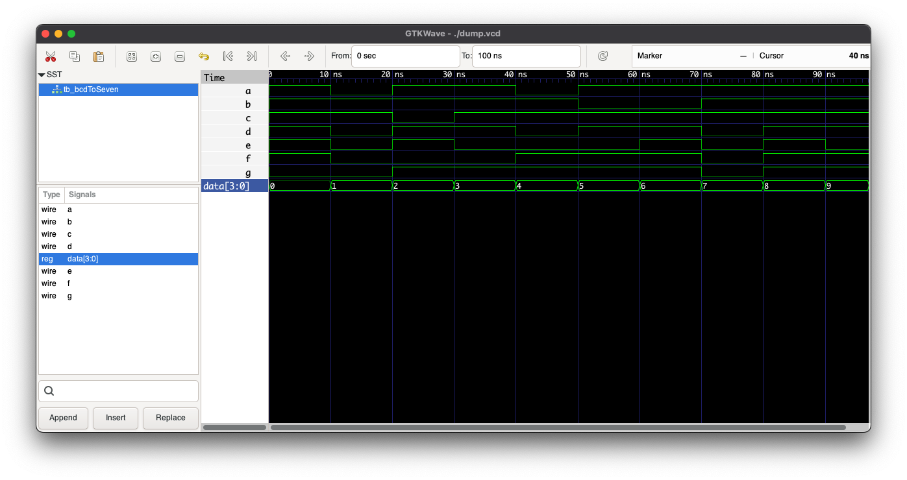

## EDA Playground

https://www.edaplayground.com/x/NTb9

## Resources

The output relations were obtained from karnough maps sourced from:
https://www.geeksforgeeks.org/bcd-to-7-segment-decoder/

## Output

